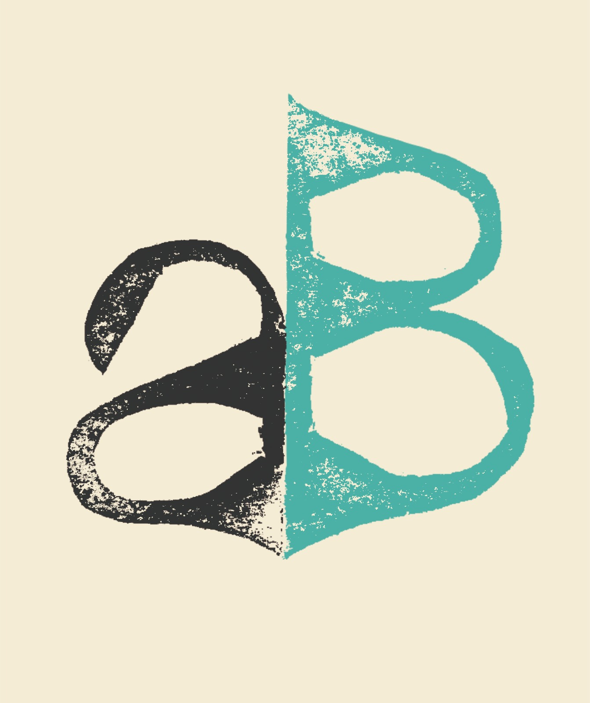
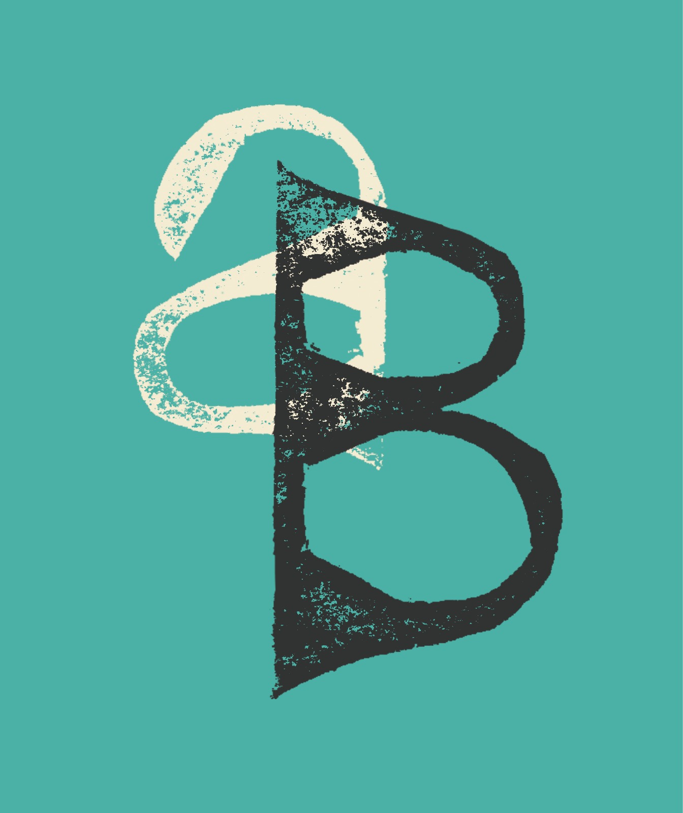
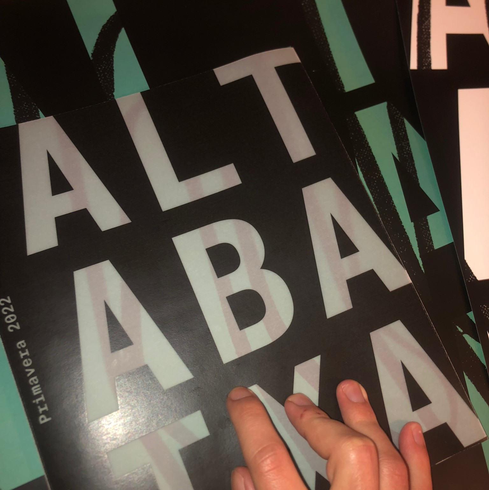
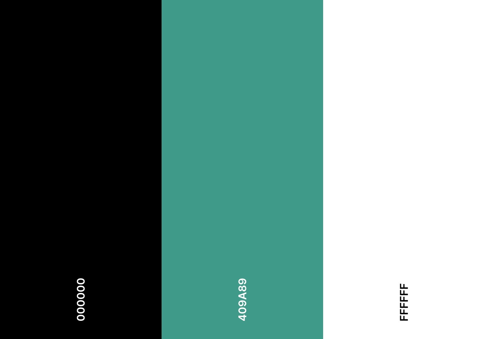
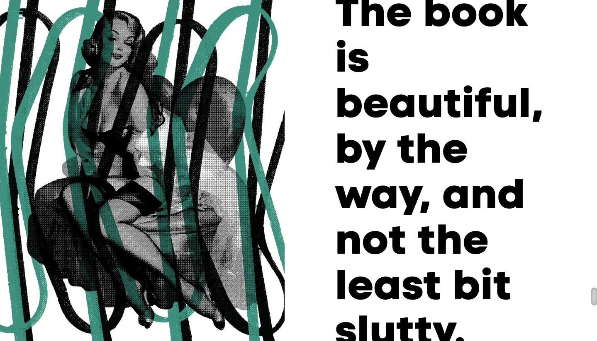
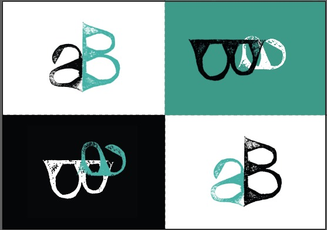
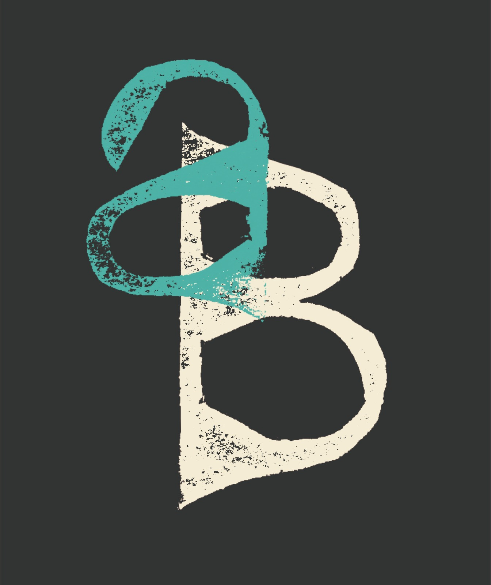
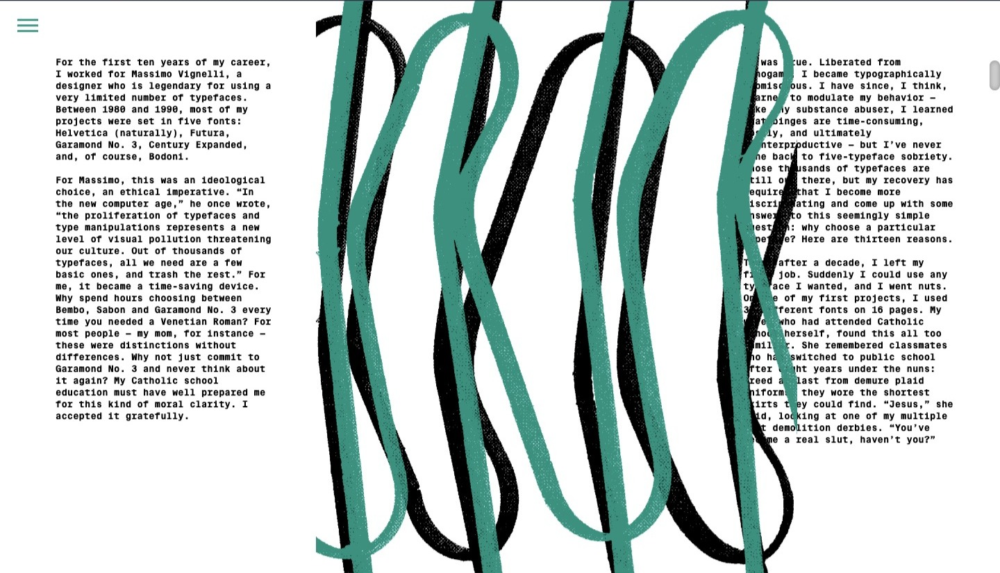

# Alta & Baixa – Typographic Culture Magazine

  
  

## 📖 Project Overview

**Alta & Baixa** is a typographic culture magazine developed as part of the **Editorial Laboratory** course in the Master's in Design and Multimedia at the University of Coimbra. This project aimed to create the **first issue** of the magazine, both in **print and web versions**.

The magazine explores **typography in a broad cultural context**, reflecting on its history, applications, and influence across different mediums. It merges academic and journalistic sources to create an eclectic and insightful perspective on typography.

## ✨ Concept & Vision

Alta & Baixa is designed to:
- **Investigate and discuss typography** beyond the technical aspects, highlighting its cultural significance.
- **Combine historical and contemporary content**, ensuring a dynamic and relevant perspective.
- **Balance design and content**, emphasizing the importance of structure and readability.
- **Adapt across print and digital media**, maintaining a coherent identity while exploring different visual possibilities.

## 📌 Structure & Content

The magazine follows a structured yet flexible editorial grid:

- **Cover**
  - *Alta & Baixa – Revista de Cultura Tipográfica*
  - Issue #1 / Coimbra, Portugal / Quarterly / Spring 2022
- **Index**
- **Editorial**
  - Introduction to the magazine’s mission and vision
- **Feature Articles**
  - *Thirteen Ways of Looking at a Typeface* – Michael Bierut
  - *Absence in Design is Very Important* – Karel Martens
- **Visual & Typographic Experiments**
  - Graphic and typographic explorations
- **Colophon**
  - Production details and credits

## 🖋️ Print Edition
- **Format:** Custom A4 (210mm x 250mm)
- **Color Scheme:** Two-color printing (green and black)

## 🌐 Web Edition
- **Landing Page:** Designed to reflect the structure of the print version
- **Interactive Features:** Typography-focused animations and user interaction

## 🎨 Promotional Materials
- **Poster:**
  - *Alta & Baixa – Revista de Cultura Tipográfica* – Coimbra, 2021
  - Print version: 50 x 70 cm
  - Digital/Motion version: Adapted for social media (e.g., 1080 x 1350 for Facebook Ads)

## 🎓 Academic Context
- **Course:** Editorial Laboratory – Master's in Design and Multimedia
- **Institution:** Faculty of Science and Technology, University of Coimbra - FCTUC
- **Professor:** Artur Rebelo
- **Team:**
  - Ana Inês França
  - José Antunes
  - Thomas Fresco

## 📷 Project Images

  
  

  
  

  
  

  
  

---

🖋 *Alta & Baixa is a creative exploration of typographic culture, bridging the past and future of design.*
